# {background-color="#fef1da"}

::::{.columns}
:::{.column width="50%"}

:::
:::{.column width="50%"}
:::{.incremental}

1. Le cadre général d'ARDoISE

1. Le cadre général de la Science Ouverte

2. Les stratégies de publication

3. L'ouverture des données

4. L'ouverture du code

:::
:::
::::

# {background-color="#fef1da"}

::::{.columns}
:::{.column width="50%"}
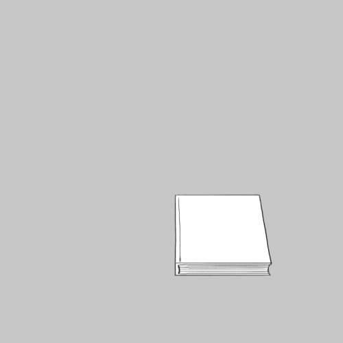
:::
:::{.column width="50%"}

<span class="title-font">1. Le dispositif ARDoISE</span>

<span class="opacity">2. Le cadre général de la Science Ouverte</span>

<span class="opacity">3. Les stratégies de publication</span>

<span class="opacity">4. L'ouverture des données</span>

<span class="opacity">5. L'ouverture du code</span>

:::
::::


## information et soutien aux équipes de recherche rennaises

::::{.columns}
:::{.column width="50%"}
::: {.fragment fragment-index=1}
dispositif de soutien, sensibilisation et accompagnement sur le code et les données
:::
::: {.fragment fragment-index=2}
...complémentaire de l'aide apportée par les établissements
:::
:::
:::{.column width="50%"}
::: {.fragment fragment-index=3}
et aussi un réseau local ( réunissant différents coeurs de métiers)
:::
::: {.fragment fragment-index=4}
...qui s'appuie sur un réseau national, l'écosystème **Recherche Data Gouv**
:::
:::
::::

## représentants des membres de l'écosystème RDG au sein d'ARDoISE

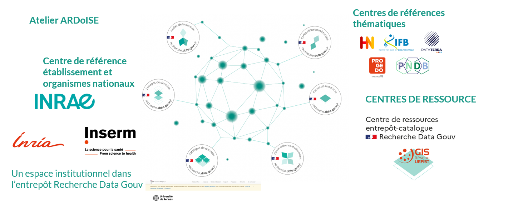{#fig-ecosys fig-alt="diagramme représentant l'écosystème Recherche Data Gouv et comportant 
1 Les ateliers de la donnée (par exemple ARDoISE) 
2 l'entrepôt de données RDG 
3 la catalogue de données 
4 les centres de ressource 
5 les centres de référence thématiques"}

## Partenaires et interlocuteurs d'ARDoISE

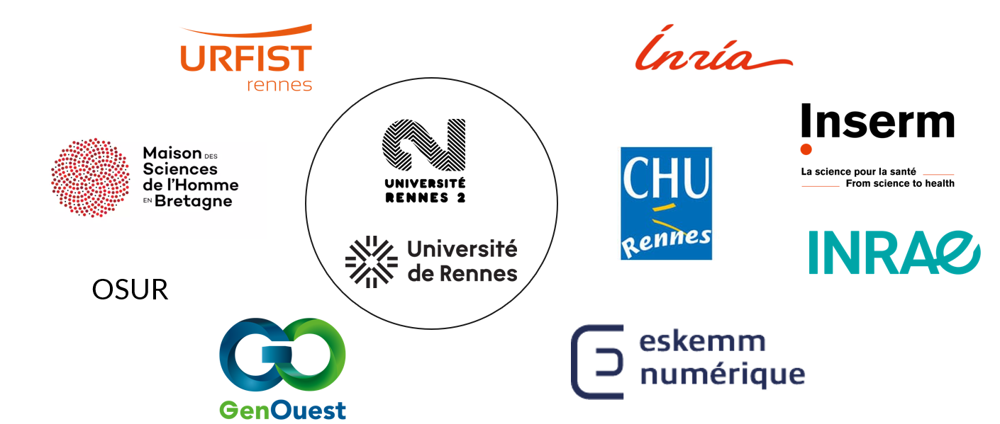{#fig-partenaires fig-alt="logos des différents partenaires d'ARDoISE : au coeur Université de Rennes et Université de Rennes, à la périphérie, logos des établissements et organismes suivants : INRAE, INSERM, INRIA, Maison des Sciences de l'Homme en Bretagne, OSUR, GenOuest, CHU, Eskemme Numérique"}

:::{.notes}
Une échelle de collaboration du dialogue à l’investissement dans le groupe de travail opérationnel en passant par le fait d’être membre du réseau élargi ARDoISE. Représente bien le paysage rennais à travers :

- ONR avec qui les université ont des partenariats (INRIA, INRAE et inserm et le cnrs via la MSHB),

- les insfrastructures  techniques (Eskemm, genouest), 
UAR( OSUR, Scanmat, Biosit, MSHB)

- un centre de ressources URFIST pour la formation

- le CHU - collaboration dans les deux sens : expertise données de santé / participation membres ardoise au nouveau Comité Scientifique et Ethique des Entrepôts de Données de Santé (CSE EDS) 
Paysage en cours de structuration, dialogue amorcé

 et  CHU participe à des réunions de réseau en présentant les recommandations pour partage de données cliniques, eskemm numérique est venu nous présenter son projet d’offre de service, INSERM 
:::

## structuration et gouvernance de l'atelier

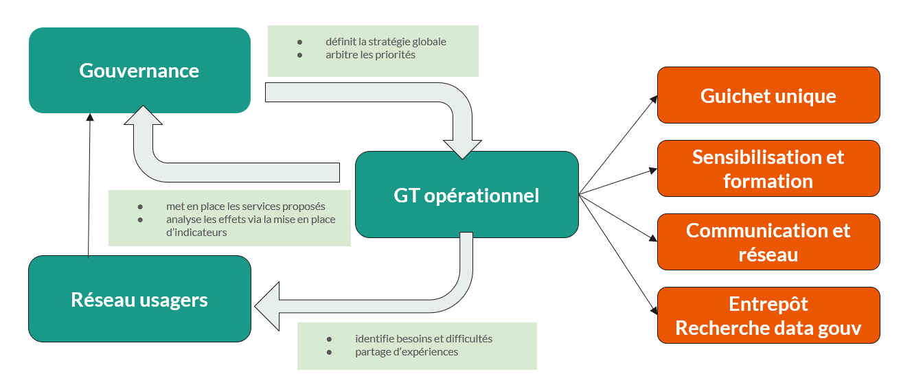


## Services au sein d'ARDoISE {.scrollable .smaller}

| Nom | rôle | Etablissement | spécificité |
|:--|:--|:--|:--|
| Fiona Edmond | coordinatrice | Université Rennes 2 | **guichet unique**, **conseils juridiques**, **archivage** |
| Manon Le Guennec | coordinatrice | Université de Rennes | **co-pilotage** |
| Cécile Sebban | resp dpt Recherche SCD | Université Rennes 2 | **animation Espace recherche** |
| Damien Belvèze | Formations doctorales, PGD | Université de Rennes | **code source et logiciels** |
| Martin Amouzou | curateur RDG | Université de Rennes et UR2 | **carnets de laboratoires**  |
| Gwenaël Dumont | ingénieure de recherche | INSERM | **préservation et sécurisation des données** |
| Florence Thiault | MCF info-com | URFIST Rennes | **Formations**, **formation continue** |
| Gwenna Briand | Data librarian | Université de Rennes | **accompagnement PGD** et **communication** |
| Aline Benvegnù Dos Santos | Ingénieure | MSHB | **accompagnement dépôt des données** |


# {background-color="#fef1da"}

::::{.columns}
:::{.column width="50%"}

:::
:::{.column width="50%"}

<span class="opacity">1. Le dispositif ARDoISE</span>

<span class="title-font">2. Le cadre général de la Science Ouverte</span>

<span class="opacity">3. Les stratégies de publication</span>

<span class="opacity">4. L'ouverture des données</span>

<span class="opacity">5. L'ouverture du code</span>

:::
::::


#  Les attendus de la science ouverte

1. Levier de croissance

2. Fiabilité des résultats

3. *empowerment*

:notebook: @ministeredelenseignementsuperieuretlarecherchePlanNationalPour2021

:::{.notes}
« La science ouverte est la diffusion sans entrave des résultats, des méthodes et des produits de la recherche scientifique. Elle s’appuie sur l’opportunité que représente la mutation numérique pour développer l’accès ouvert aux publications et – autant que possible – aux données, aux codes sources et aux méthodes de la recherche. Elle permet à la recherche financée sur fonds publics de conserver la maîtrise des résultats qu’elle produit. Elle construit un écosystème dans lequel la science est plus transparente, plus solidement étayée et reproductible, plus efficace et cumulative. Elle induit une démocratisation de l’accès aux savoirs, utile à l’enseignement, à la formation, à l’économie, aux politiques publiques, aux citoyens et à la société dans son ensemble. Elle constitue enfin un levier pour l’intégrité scientifique et favorise la confiance des citoyens dans la science.

(source: Deuxième Plan National pour la Science Ouverte, 2022)
:::


## Levier de croissance 

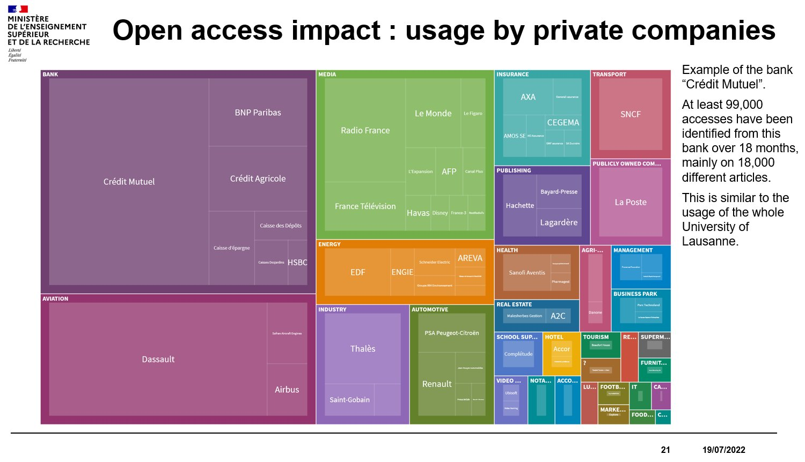

:::{.notes}
Les grandes entreprises font un usage plus important que par le passé des publications ouvertes. D'après des chiffres publiés par Marin Dacos en 2022, l'usage de publications en open access par le Crédit Mutuel est aussi important quantitativement que le téléchargement d'articles en open access de l'ensemble des chercheurs de Lausanne.
:::


## reproductibilité, intégrité 

::::{.columns}
:::{.column width="50%}
```{=html}
<video width="400" controls loop>
<source src="images/invisible_horse.mp4" />
</video>
```
:::
:::{.column width="50%"}

Première condition de la reproductibilité : 

- accès aux données et au code, 
- le tout bien documenté
:::
::::

## Accès des citoyens à l'information scientifique 

::::{.columns}
:::{.column width="50%"}
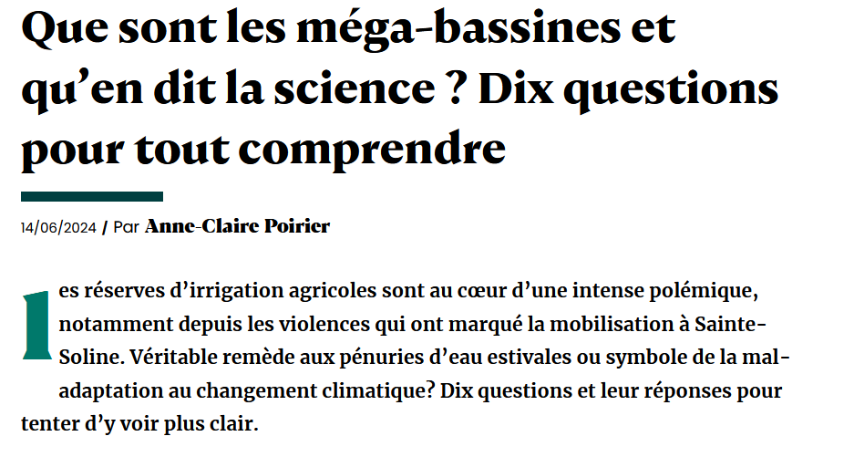
:::
:::{.column width="50%"}
- patients experts
- usages militants de l'information scientifique
:::
::::

## économie d'énergie et de temps 

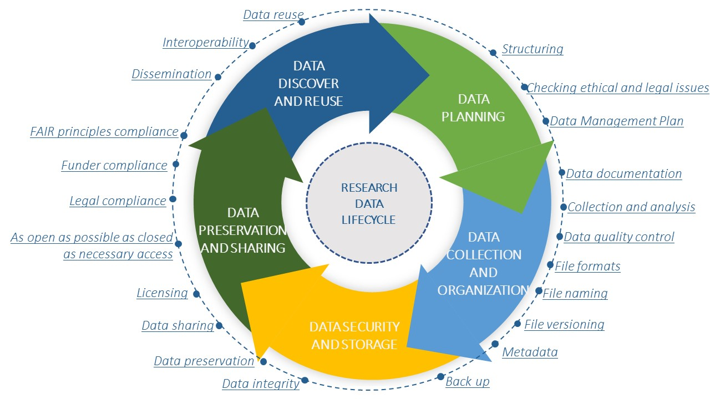

:::{.notes}
cf Question comprise dans le PGD aussi bien que dans la réponse à l'appel à projet européen (RepAAPE) allez-vous réutiliser des données déjà disponibles ?
:::

# {background-color="#fef1da"}

::::{.columns}
:::{.column width="50%"}

:::
:::{.column width="50%"}

<span class="opacity">1. Le dispositif ARDoISE</span>

<span class="opacity">2. Le cadre général de la Science Ouverte</span>

<span class="title-font">3. Les stratégies de publication</span>

<span class="opacity">4. L'ouverture des données</span>

<span class="opacity">5. L'ouverture du code</span>

:::
::::

## Voie verte 

<iframe frameborder="0" height="900" id="publi.general.voies-ouverture.chart-repartition-publications" src="https://barometredelascienceouverte.esr.gouv.fr/integration/fr/publi.general.voies-ouverture.chart-repartition-publications?bsoLocalAffiliation=91D9w&amp;displayComment=false&amp;displayTitle=false&amp;displayFooter=false&amp;endYear=2022&amp;lastObservationYear=2023&amp;startYear=2016&amp;firstObservationYear=2018&amp;useHalId=false" title="publi.general.voies-ouverture.chart-repartition-publications" width="99%"></iframe>

:::{.notes}
Note sur les 5% uniquement présents sur le site de l'éditeur : ce sont en général des articles publiés en "free" chez l'éditeur, sans licence CC, et dont l'auteur correspondant n'a pas voulu (ou pu) fournir à l'administrateur HAL une version auteur.
On peut parler ici de "bronze OA"

L'admin HAL dépose en effet systématiquement les fichiers sous licence CC (à l'exception des articles OA d'OpenEdition car le CC s'applique souvent au texte, et pas aux figures). Il y a aussi des liens Unpaywall erronés (ex : fichiers de données supplémentaires), mais ça reste marginal.

:::

## Stratégie de rétention des droits 1/2 {.r-fit-text}

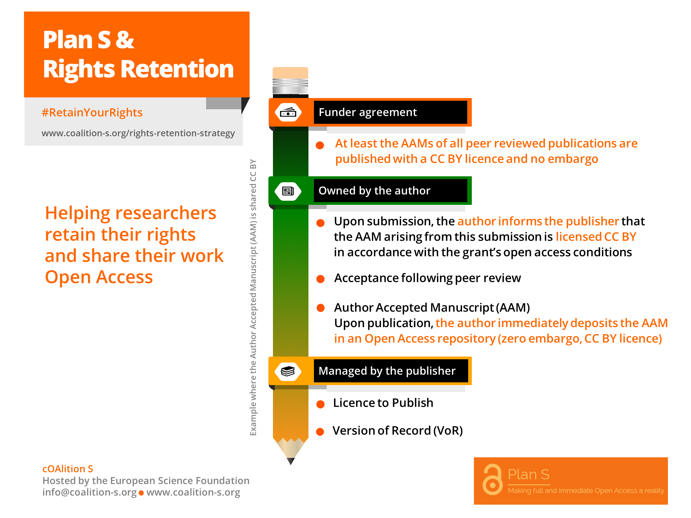


## Stratégie de rétention des droits 2/2 

::::{.columns}
:::{.column width="50%"}
:::{.incremental}
:white_check_mark: accès immédiat  
:white_check_mark: encouragé par les financeurs  
:white_check_mark: démarche simple à réaliser du côté des chercheurs  
:::
:::
:::{.column width="50%"}
:::{.incremental}
:x: opposition de certains éditeurs  
:x: paiement de charges additionnelles  
:x: manque de support des universités  
:x: sacralisation du droit d'auteur en France qui joue contre les auteurs et pour les éditeurs  
:::
:::
::::


## Voie dorée

:::{.incremental}
- la voie dorée n'implique pas forcément des APC (Article Processing Charges)    
- Mais le marché rend ces coûts somptuaires (Nature : min 9500$ l'article)   
- les barrières tombent pour le lecteur et s'érigent devant l'auteur  
- les APC sont monitorés par le SCD
- [accords Read and Publish passés avec la bibliothèque](https://scienceouverte.univ-rennes.fr/publier-en-open-access#p-38)   
:::

:::{.notes}
Distinction accords Read and publish (RAP) et Publish and Read (PAR) : les premiers sont calculés sur le coût de l'abonnement au contenu de l'éditeur ; les seconds sur les APC annuels facturés à l'éditeur, selon l'historique de l'institution de recherche qui est au départ abonnée à un portefeuille ou bien gère des publications ouvertes
:::


## l'impasse des accords transformants

::::{.columns}
:::{.column width="50%"}
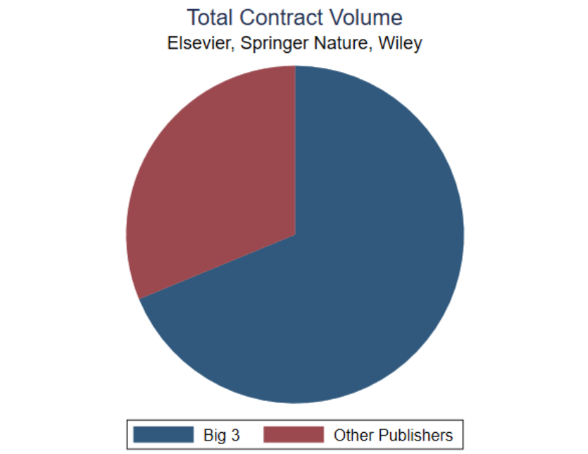{#fig_big3 fig-alt="un camembert montrant que les deux tiers du volume des journaux négociés dans le cadre d'un accord publish & read (chiffres mondiaux) appartiennent à l'un des Big3 Elsevier, Springer Nature, Wiley"}
:::
:::{.column width="50%"}
:::{.incremental}
- poids inégal dans la négociation (Nord/Sud)
- empêche la transition vers le full open access
- effet Mattieu :notebook: @rothfritzTrappedTransformativeAgreements2024a
:::
:::
::::

## Stratégies de publication

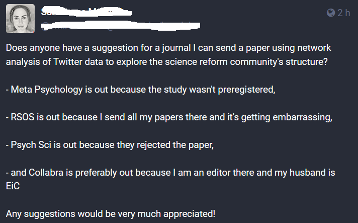{#fig-strategy fig-alt="Tweet d'une chercheuse qui se demande où publier son dernier article : Ce n'est plus possible dans la revue Meta Psychology parce qu'elle n'a pas déposé de pré-enregistrement de l'étude, elle ne veut pas comme d'habitude publier chez RSOS parce qu'elle estime qu'on pourrait lui reprocher de publier toujours chez le même éditeur, Psych Sci a refusé son manuscrit et elle préfère éviter Collabra parce qu'elle est membre du comité éditorial de la revue et que son mari est éditeur en chef"}

## Pré-enregistrements

un enjeu de **reproductibilité**, mais aussi une charge supplémentaire 

:::{.incremental}
- plan de recherche (questions + hypothèses)
- conception de la méthode de collecte des données
- plan pour l'analyse des données
:::


:::{.notes}
 the plan for a research study, including research questions/ hypotheses, details about the research design, and/ or plans for data analysis, which has been made available for public sharing in order to ensure unbiased reporting and support the differentiation of planned and unplanned research directions
(définition :notebook: @plosNewOpenScience2024a)
:::

## le pré-enregistrement comme enjeu d'intégrité scientifique

[p-hacking](https://fivethirtyeight.com/features/science-isnt-broken/)

p-harking

biais de publication

## Où pré-enregistre t-on ?

- [Prospero](https://www.crd.york.ac.uk/prospero/) : revues systématiques
- [clinicaltrials.gov](clinicaltrials.gov) : études cliniques
- [Zenodo](https://zenodo.org) : toutes disciplines
- [osf.io](https://osf.io/) : toutes disciplines

## une façon de jouer avec les contraintes

- enregistrer une méthode A et une question B et mettre en oeuvre dans le cours de l'expérience la méthode A mais aussi une méthode C qui répond à la question B mais aussi à la question D
- enregistrer une méthode A de façon suffisamment vague pour qu'elle puisse impliquer aussi la méthode B et C, définir les questions de manière imprécise


# {background-color="#fef1da"}

::::{.columns}
:::{.column width="50%"}

:::
:::{.column width="50%"}

<span class="opacity">1. Le dispositif ARDoISE</span>

<span class="opacity">2. Le cadre général de la Science Ouverte</span>

<span class="opacity">3. Les stratégies de publication</span>

<span class="title-font">4. L'ouverture des données</span>

<span class="opacity">5. L'ouverture du code</span>

:::
::::

## Principes FAIR : faciliter la découverte du jeu de données 

FAIR (Findability, Accessibility, Interoperability, Reusability)

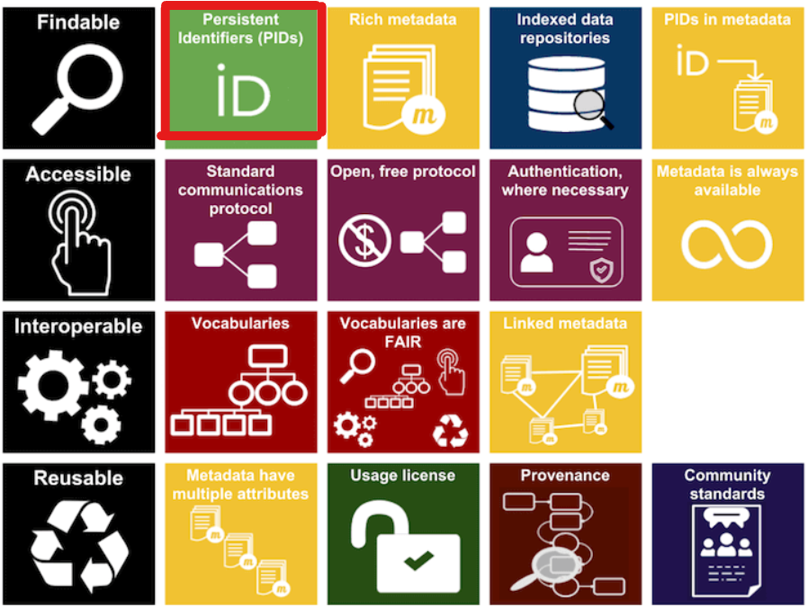{#fig-fair fig-alt="Cette image représente les principes du cadre de données FAIR (Findable, Accessible, Interoperable, and Reusable). L'image est organisée en quatre colonnes, chacune correspondant à l'un des quatre principes FAIR, avec des icônes et des zones de texte représentant les exigences spécifiques de chaque principe. En voici un aperçu :
REPERABLE:  (colonne la plus à gauche, fond noir) :
L'icône d'une loupe représente la possibilité de rechercher et de trouver des données.
Identifiants persistants (PID) avec un symbole de carte d'identité.
Les métadonnées riches sont représentées par une icône de pile de documents.
Les référentiels de données indexées sont représentés par l'icône d'une base de données.
Identifiants persistants dans les métadonnées avec le symbole d'une carte d'identité et un document.
ACCESSIBLE (deuxième colonne, fond violet foncé) :
Un doigt appuyant sur un bouton, représentant l'accessibilité.
Protocole de communication standard avec un diagramme de réseau.
Protocole ouvert et libre avec des nœuds connectés et des signes de dollar indiquant un accès gratuit.
Authentification, le cas échéant avec l'icône d'un badge d'identification.
Les métadonnées sont toujours disponibles grâce à un symbole de boucle infinie.
INTEROPERABLE (troisième colonne, fond rouge foncé) :
Une icône d'engrenage représentant l'interopérabilité.
Vocabulaires avec un symbole d'organigramme de boîtes interconnectées.
Vocabulaires conformes à FAIR : icône représentant des ressources interconnectées conformes à FAIR.
Métadonnées liées symbolisées par des documents connectés avec des symboles de métadonnées.
REUTILISABLE (colonne la plus à droite, fond bleu/jaune/vert) :
Une icône de recyclage symbolisant la réutilisation.
Les métadonnées ont des attributs multiples et sont représentées par une icône de pile de documents. L'usage d'une licence représentée par un cadenas ouverte et une marque d'approbation. La provenance représentée par un diagramme pointant l'origine des données. Les normes fixées par la communauté, représentée par une icone ou une communauté se retrouve autour d'un tableau. Tous les éléments figurés mettent en valeur les aspects spécifiques de la gestion des données lorsqu'on veut la rendre conforme aux princopes FAIR afin de s'assurer que les données utilisées et partagées d'un système à l'autre et d'une communauté de recherche à l'autre"}


# A propos des entrepôts de données

:::{.incremental}
- Eviter les entrepôts commerciaux (figshare)
- Vérifier les licences utilisables et les politiques des entrepôts
- y a t-il une curation
- entrepôt situé en Europe (RGPD) ?
:::
[guide du COSO](https://www.ouvrirlascience.fr/research-data-how-to-choose-a-repository/)

[recherche data gouv](https://entrepot.recherche.data.gouv.fr/dataverse/univ-rennes)

:::{.notes}

- Is the repository future-proof? : the chosen repository should have been online for at least 5 years.

- **Does the repository's policy restricts the choice of licences that can assigned to your data? : if you cannot share your data under the licence you have chosen, you would better find a better offer elsewhere.** For instance Dryad makes compulsory the use of CC0 to datasets, which is not aligned with French author rights.

- **Are deposits curated by someone? Without a proper curation, your may neglect important metadata in your dataset's description which could have a negative impact on its findability and reusability.**

- Do you have to pay to deposit your data? Some fees are abusive, particularly in the for-profit sector, where some big companies charge costs that bear no relation to the service provided

- **Is the repository located in Europe? GDPR compliance is at stake**

:::

## aussi ouvert que possible, aussi fermé que nécessaire

L'ouverture peut être limitée par l'une des raisons suivantes

::: {.fragment fragment-index=1}
- RGPD (données personnelles)
:::
::: {.fragment fragment-index=2}
- accord de consortium: 
   * secret industrial
   * régimes de droit différents entre pays
:::

::: {.fragment fragment-index=3}
propriété intellectuelle : textes, images
:::

## Accès à la donnée : respecter les règles du jeu {.smaller}

::::{.columns}
:::{.column width="50%"}
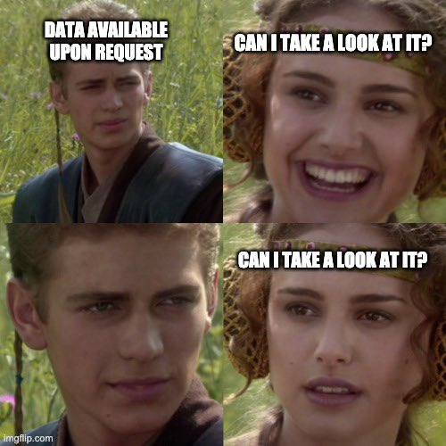
:::
:::{.column width="50%"}
:::{.incremental}

- Un DAS ne peut pas simplement contenir: "Data not available" :angry:

- si les données sont accessibles sur demande : quelqu'un.e doit répondre aux demandes

-  2022, sur 3416 DAS, 93% de réponses négatives ou d'absences de réponses  :notebook: @gabelicaManyResearchersWere2022a 
:::
:::
::::

:::{.notes}
a 2022 study of 3416 articles with a DAS showed that in 93% of cases, authors did not respond to requests or responded negatively without justification

Outside the openness of the data as set by the authors, Accessibility is considered as a rather straightforward condition to implement, but actullay it's not : think of connectivity issues for researchers in developing countries, how to address the probleme of lack of bandwidth for "the last kilometer" (see for instance :notebook: @shanahanRethinkingFAIRData2022a )

@brownFixingScienceMeans2024a : A DAS in itself is not enough, what counts is the accessibility of data whenever it's possible
:::


## utiliser des formats ouverts

::::{.columns}
:::{.column width="50%"}

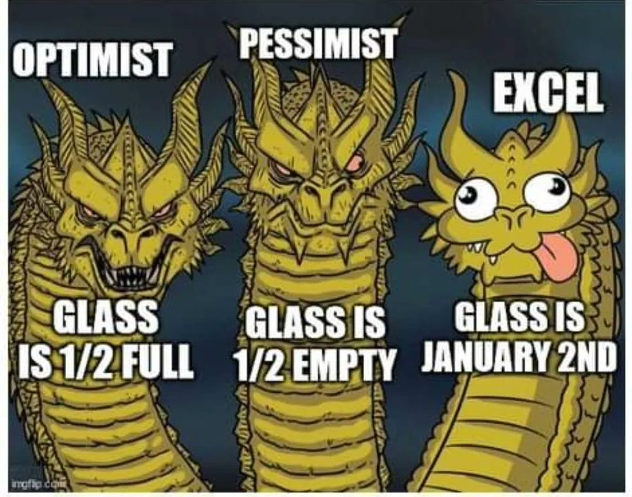{fig-alt="three chinese dragons are figured : the first one has an agressive look, this dragon embodies optimism ; the caption stands that the glass is half full, the second one has a tragic look ; the caption stands that the glass is half empty, it embodies pessimism, the third one has a crazy and funny look : this dragon cannot be taken seriously ; the caption stands that glass is january second in reference to common excel formatting number errors, when 1/2 is inadvertingly converted into a date (2nd of january)"}
:::
:::{.column width="50%"}
:::{.incremental}
- cf. RDM scary tale ([costly birthdays](https://forschungsdaten-thueringen.de/stories/articles/counter-eng.html)) 
- choisir des formats libres (oubliez Microsoft)
- choisir des outils transparents (R plutôt que Word et Excel)
:::
:::
::::

:::{.notes}
In R, every data manipulation is traceable (codeline) ; an unexpected conversion can simply not occur. Provided the packages versions used are still available, anything can be replicated from the beginning.
:::

## utiliser des licences standard et ouvertes

:::{.incremental}
- en France 2 options possibles : ODBL / Etalab
- le chercheur à la **paternité** des données mais pas leur **propriété**
- obtenir des citations pour des jeux de données
- valoriser logiciels et jeux de données avec des articles de présentation : data et software papers
:::


# {background-color="#fef1da"}

::::{.columns}
:::{.column width="50%"}

:::
:::{.column width="50%"}

<span class="opacity">1. Le dispositif ARDoISE</span>

<span class="opacity">2. Le cadre général de la Science Ouverte</span>

<span class="opacity">3. Les stratégies de publication</span>

<span class="opacity">4. L'ouverture des données</span>

<span class="title-font">5. L'ouverture du code</span>

:::
::::

# conservation et partage du code source {.smaller}

::::{.columns}
:::{.column width="50%"}
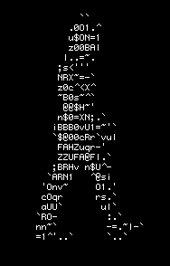{#fig-code fig-alt="un gif representant la silhouette d'un homme qui marche, du code défile dans cette silhouette"}
:::
:::{.column width="50%"}
:::{.incremental}
- les débats sur l'intégrité scientifique se focalisent sur l'accès aux données, mais les tentatives de réplicabilité de code restent l'exception

- Peu d'incitations à partager son code source :notebook: @jean-quartierSharingPracticesSoftware2024a

- rares sont les éditeurs qui demandent aux reviewers d'évaluer la réplicabilité du code source hors des sciences computationnelles.
:::
:::
::::

## Archive and make visible

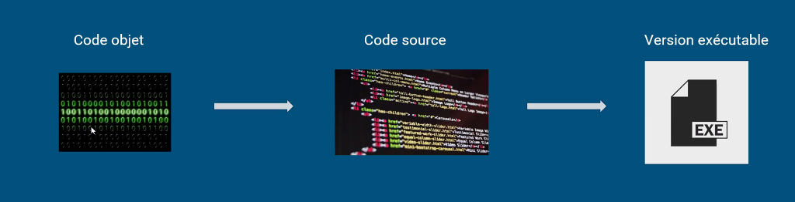{#fig-executable fig-alt="three screenshots explaining the differences between 1. binaries files 2. source code and 3. executable files"}

- **code source** (et non l'algorithme ni les binaires/executable)
- une forge n'est pas une archive (**les forges ne sont pas pérennes** - cf Bitbucket in 2020)

:::{.notes}
Program must be written for people to read and only incidentally for machines to execute (Harold Abelson, 1985). Most of the times, compilers are not reproducible enough.
:::

## {background-color="#fef1da"}

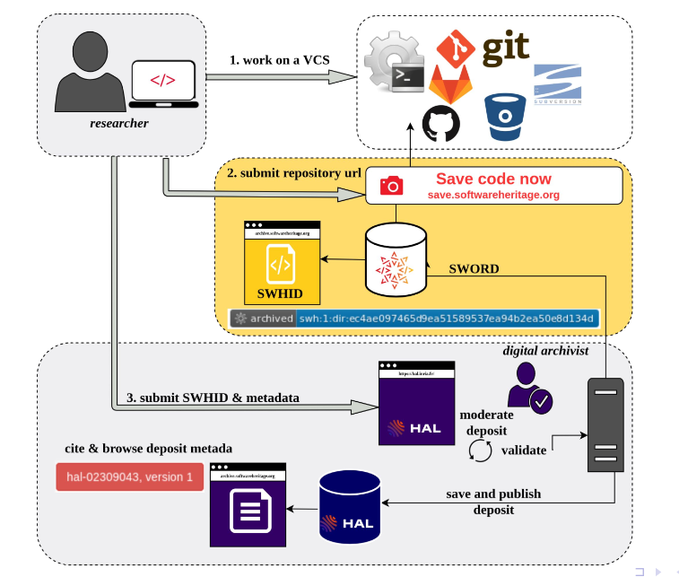{#fig-workflow fig-alt="a workflow diagram showing how source code can be saved directly from the forge to the Software Heritage Archive and how source code metadata can be extracted from the repo on Software Heritage to be imported into HAL archive, so that a link may be added between the publication and its underlying source code"}

## reproductibilité computationnelle du code

ne pas sauvegarder seulement le code source mais aussi

::: {.fragment fragment-index=1}
la pile logicielle dans des environnements virtuels (venv/Renv)
:::
::: {.fragment fragment-index=2}
l'environnement d'exécution à travers des conteneurs,  :notebook: @ziemannFivePillarsComputational2023
:::
::: {.fragment fragment-index=3}
Utiliser des gestionnaires de packages (Guix) qui facilitent la conservation des packages utilisés :notebook: @gorgolewskiPracticalGuideImproving2016
:::

# Références

